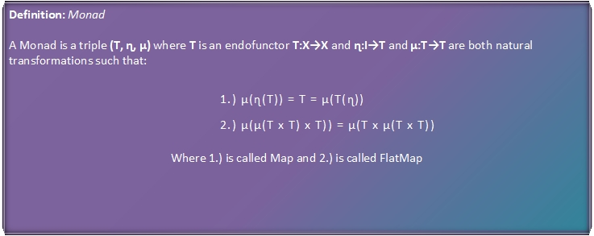

# UnderRadicals

  

> I am no-one special. I just want to build things either I find cool and helpful or other developers and like-minded individuals might find helpful. 

## Fun Facts
- I like working on the Back-End with Databases and large datasets. 
- I also like working on the Front-End when the Design is something I am in love with. 
- I throw away code. Why? REASONS! 
- My GitHub looks like I don't code, but I have been doing this for 15 yrs.
- I enjoy the abstract things more than I do the applied nature of Software Development. 
  - Architecture
  - Design Patterns
  - System Design
  - Algorithm Design
  - Cryptography
- Favorite Languages:
  - C#
  - Python
  - SQL
  - Scala (No, that does not mean I love math and am super smart)
- I love Math (I am super smart?) when compared to a 2 year old. 

## Facts
- I don't know everything
- I love learning new things
- Creating Software is Hard
  - Have some patience
  - Be kind
  - Soft Skills are a learned behavior
  - Hard Skills are hard fought

## Things that matter
- Doing what you love
- Taking it seriously but not treating it like a job, unless that is what works for you.
- Care about what you make...and only then will you write better code. 
- Quality means satisfy the requirements, that means Great Software does things greatly, it does not necessarily mean that it has to do great things. 
